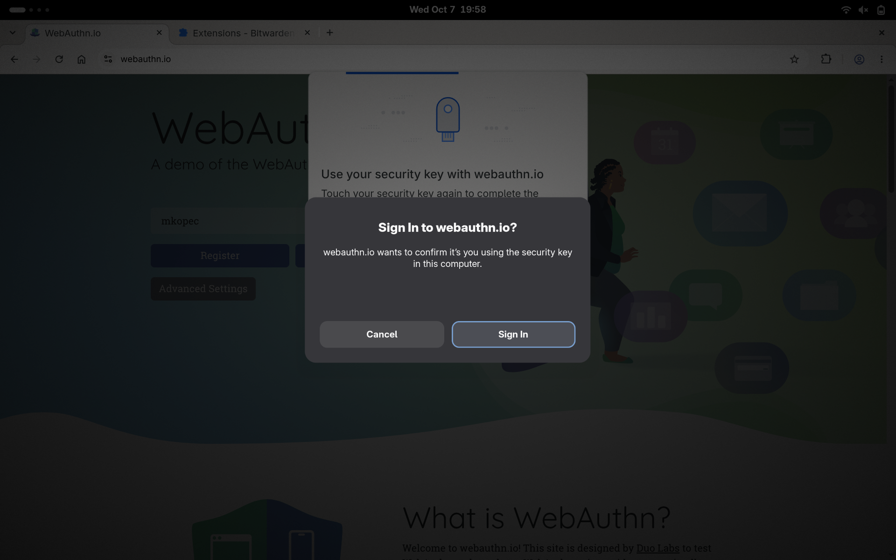
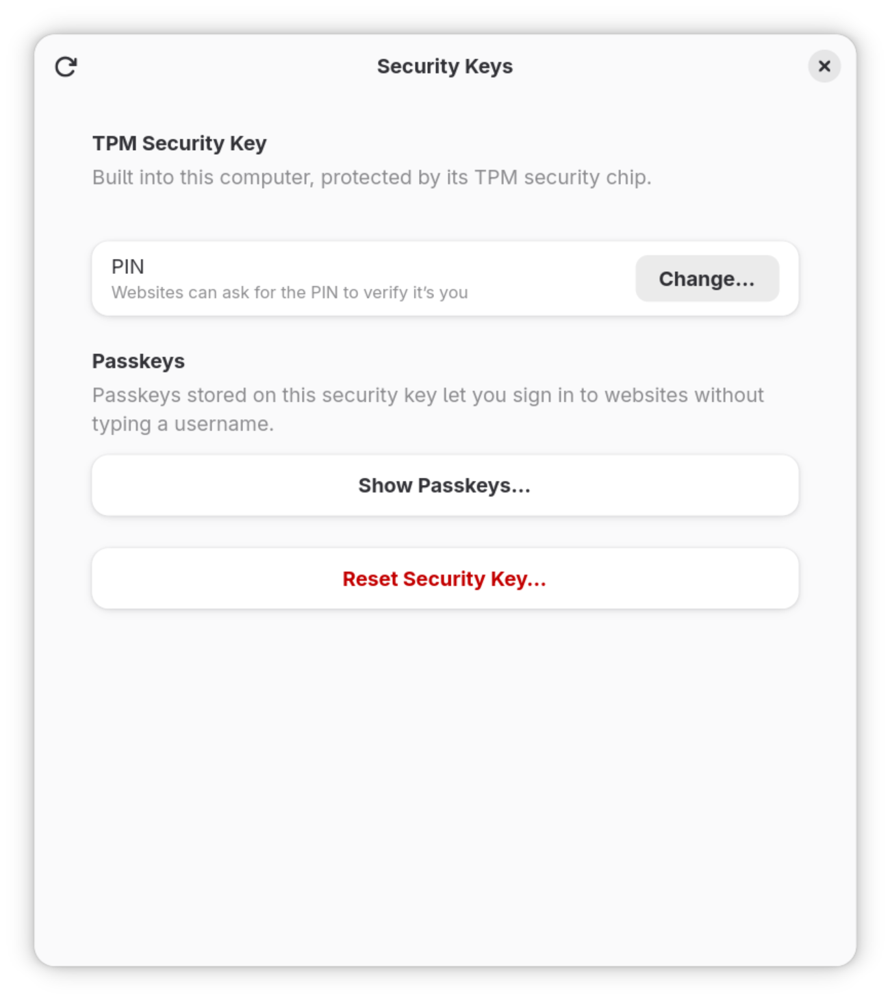

# Keepsake

Keepsake is a FIDO security key for Linux that keeps its keys in your computer's TPM. It uses Linux's [uhid](https://github.com/psanford/uhid) facility to emulate a USB security key, so browsers and other FIDO clients detect it like a hardware key.

Keepsake started as a fork of Peter Sanford's [tpm-fido](https://github.com/psanford/tpm-fido); credentials registered with tpm-fido keep working.

It speaks U2F and CTAP 2.0: passkeys, a PIN enforced by the TPM, `hmac-secret` (e.g. for LUKS) and `credProtect`. On GNOME it uses the system prompt for confirmations, refuses requests while the screen is locked, works with GNOME's SSH agent, and comes with a "Security Keys" app.

## Screenshots




## Quick start

```
make install               # as the user who will use keepsake; no root needed
sudo make install-system   # once per machine, then log out and back in
make enable                # start keepsake now and with every graphical login
```

Then set the TPM's lockout authorization (`tpm2_changeauth -c lockout <password>`) and set a PIN, e.g. in the Security Keys app. See [Installing](docs/installing.md) for details.

## Documentation

* [Installing](docs/installing.md): installation, permissions, dependencies
* [Security](docs/security.md): what Keepsake protects against and what it doesn't, bus encryption, boot state binding
* [Design](docs/design.md): key handles, the device key, supported CTAP commands, the signature counter
* [Passkeys and reset](docs/passkeys.md)
* [PIN and user verification](docs/pin.md): the PIN in the TPM, `credProtect`
* [hmac-secret](docs/hmac-secret.md): disk encryption and other derived secrets
* [Desktop integration](docs/desktop.md): dialogs, screen lock, requests without a dialog, systemd, the Security Keys app
* [SSH](docs/ssh.md): `ecdsa-sk` keys and GNOME's SSH agent
* [Several users and TPM objects](docs/multi-user.md)
* [Testing](docs/testing.md)

## Source layout

* `src/`: the Keepsake daemon (Go, package `main`) and its packages
* `src/cmd/keepsake-askpass/`: the SSH askpass program
* `src/settings/`: the Security Keys app (Python, GTK 4 / libadwaita)
* `contrib/`: systemd unit and udev rule
* `scripts/`: test helpers
